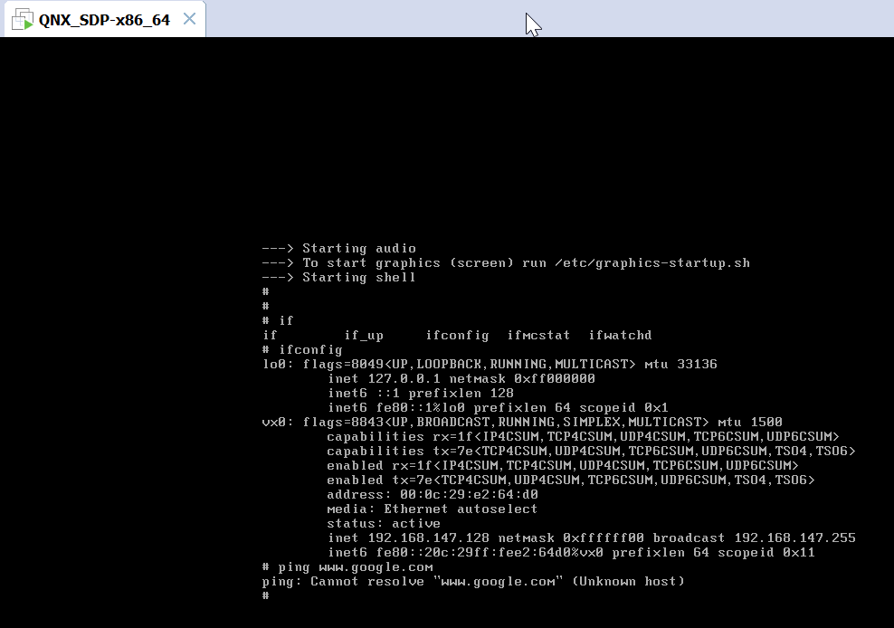
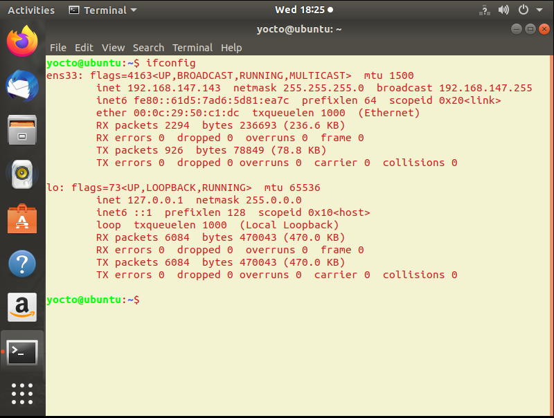
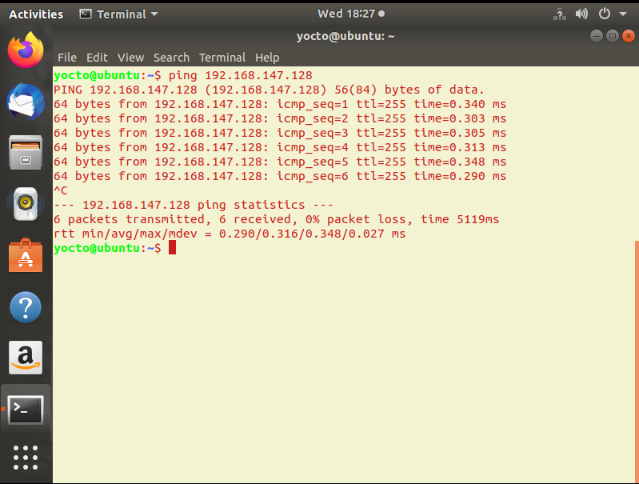
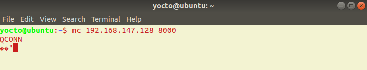
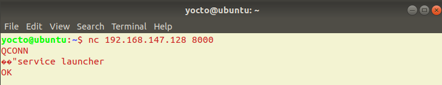
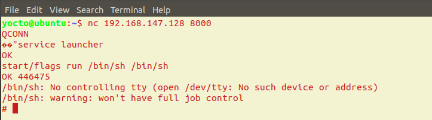
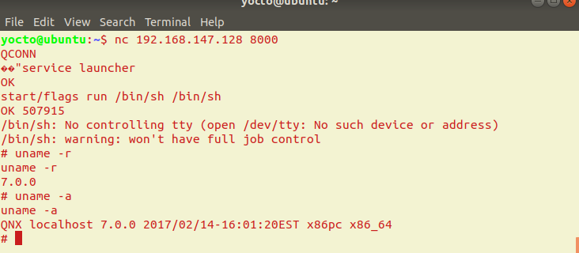
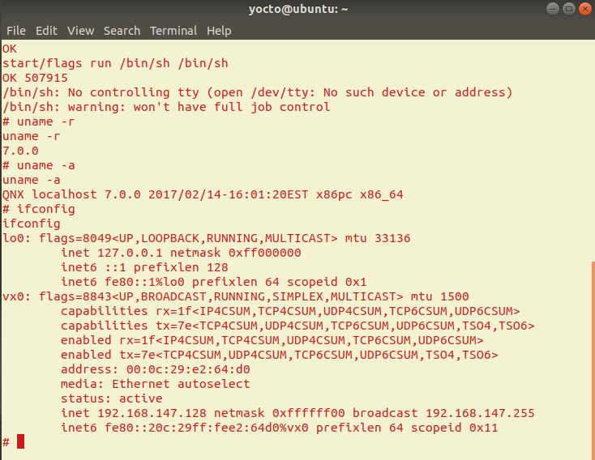

# QNX Hacking: Over Qconn

Qconn – It’s a daemon which provides visibility for looking at File System and System Processes and a lot more, via the QNX Momentics IDE.

The QNX Momentics IDE does not require password to authenticate incoming qconn request. This is a fundamental flaw which QNX Systems has not fixed or do not want to fixed??????

So we will take the advantage of this flaw of QNX and try to get root privilege access on the QNX from any LinuxHost machine. We will use some basic commands of netwrok remote access `netcat`. Usually Qconn service runs on `8000` port. We can also use namp or some other network information gathering tool to find out Qconn service running port.

## Test Setup

1. Running QNX Virtual machine [I have QNX VMX Image for X86_64 architecture]

2. Linux Host machine [I have Ubuntu 18.04 running on Virtual machine]

3. Network communication between both machine [Both virtual machine are running on Windows Host with NAT netwrok configuration]

## Attack Execution

`Step-1:` Run the QNX Virtual machine and type `ifconfig` to get the IP address.

`Step-2:` Run the Linux Virtual machine and type `ifconfig` to get the IP address.

`Step-3:` Check the netwrok communication between both machines.

`Step-4:` Execute the command from attacker machine.

`Step-5:` Check Service launcher status on target.

`Step-6:` Start process with flag run and provide `command` in our case we want the shell access `/bin/sh`.

Note: In some case you may change the path of shell executable (/usr/bin/sh or /sbin/sh etc..). You can execute any command as per your requirement (/bin/shutdown etc).

`Step-7:` Check that we got the access to the QNX target machine with root privileges.

## Useful Tricks

* It may possible that Qconn is not running on default port. In that case we have to scan the services running on Target machine. So we can get the port number for Qconn service. Recommendation is to use `NMAP` command.

* Do not press `Enter` in between command is executing.

* You can write some basic python script to automate this process.

* Qconn vulnerability is released with the name of `QNX 6.5.0/QCONN 1.4.207944-Remote Command Execution` and the published with `CVE-ID:21520`.

## Useful Links

* https://www.exploit-db.com/exploits/21520
* http://illmatics.com/Remote%20Car%20Hacking.pdf
* https://www.optiv.com/blog/pentesting-qnx-neutrino-rtos
